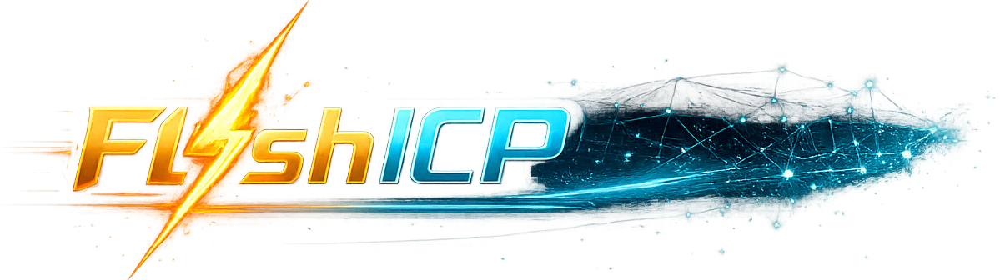
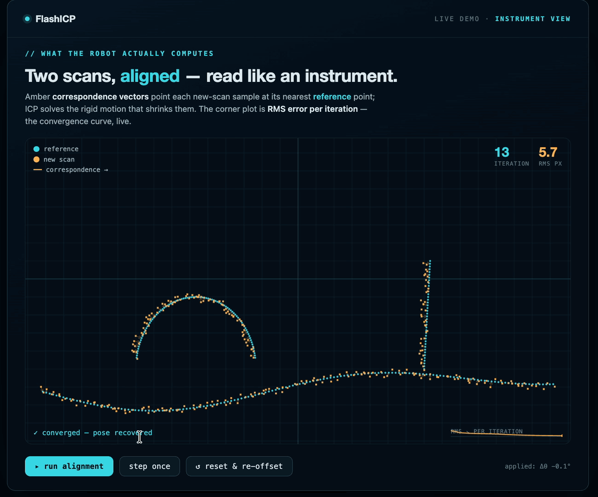

<p align="center">
  
</p>

<p align="center">
  <a href="https://github.com/wuisabel-gif/FlashICP/actions/workflows/build.yml">
    
  </a>
</p>

GPU-accelerated ICP (Iterative Closest Point) for underwater point clouds, written in CUDA.

FlashICP takes the registered point cloud from an AUV's stereo camera and aligns
consecutive scans on the GPU — the same point-cloud frontend a factor-graph SLAM
backend (e.g. GTSAM) relies on, but fast enough to keep up on a Jetson.

It is built and benchmarked against **real AUV rosbags** (Barracuda / ZED Mini),
so every kernel has a CPU baseline and a measured speedup on actual data, not a
synthetic benchmark.

<p align="center">
  
  <br>
  <sub>ICP in action — each new scan (amber) snaps onto the reference cloud (cyan); correspondence
  vectors shrink as the RMS error converges. Illustrative 2D view of the loop; on the robot it runs in CUDA on a Jetson.</sub>
</p>

## Why it matters

Underwater there is no GPS and no radio, so a robot has to work out its own motion
purely from what its cameras and sonar see, every frame, or it silently loses track
of where it is. The catch: that perception has to run on a **small, battery-powered
computer sealed inside the hull**, not a datacenter. Today that limit is why so much
subsea inspection still needs **divers or a crewed support vessel on station**, the
expensive part of the job.

Making the perception fast *on the hardware the robot already carries* is what changes
that. FlashICP's payoff is concrete:

- **Cheaper missions.** Reliable GPS-free autonomy means fewer ship-days and dive crews.
- **Longer endurance.** Every millisecond and watt saved on compute is more battery for
  the actual mission.
- **Same chip, more capability.** A faster kernel at the same power lets one Jetson run
  perception *and* mapping *and* avoidance, instead of demanding a bigger, hotter box.

The measured **3.0× speedup at the same power** is a small, honest step toward exactly
that: doing more of the robot's thinking onboard, for less.

## Why a GPU

The point-cloud → ICP step is the hot path of a visual SLAM frontend: large clouds,
per-point work, run every keyframe. That is exactly the shape a GPU is built for.
FlashICP rebuilds that path in CUDA to (a) learn the core GPU patterns (spatial
hashing, parallel reduction, memory coalescing) and (b) produce a genuinely useful,
benchmarkable result.

## Pipeline

```
rosbag point cloud  ─►  GPU preprocess  ─►  GPU correspondence  ─►  build + solve  ─►  pose
 (ZED registered)       voxel / crop /       nearest-neighbor       6x6 normal eqs     (T)
                        outlier / normals     via voxel grid         (reduction)
```

## Status

Early but real: GPU voxel-grid downsample with a CPU baseline + timing harness,
benchmarked on a real recorded ZED point cloud on a Jetson AGX Orin. The first sort-based
port measured 0.7× (slower than CPU); the single-pass atomic-hash rewrite runs
**3.0× faster than the CPU** (0.998 ms vs 2.991 ms, bit-exact output). Full
story in `docs/jetson_runlog.md`.

## Build & run

**1. Dump a cloud from a rosbag** (no ROS needed):
```bash
python3 tools/dump_cloud.py /path/to/bag.db3 --out-dir data --max 2
# -> data/cloud0.bin, data/cloud1.bin  (int32 n, then n*(float x,y,z))
```

**2. Build:**
```bash
cmake -B build -DUSE_CUDA=ON      # CUDA auto-disables if no nvcc (e.g. on a Mac)
cmake --build build
```

**3. Benchmark CPU vs GPU:**
```bash
./build/flashicp bench data/cloud0.bin 0.05 50
# loaded 113301 points, leaf=0.050 m, iters=50
# CPU voxel downsample: 2.991 ms  -> 1358 voxels
# GPU voxel (sort): 4.683 ms  -> 1358 voxels  (0.6x vs CPU)
#   check: PASS (matches CPU)
# GPU voxel (hash): 0.998 ms  -> 1358 voxels  (3.0x vs CPU)
#   check: PASS (matches CPU)
```

- On a **Jetson Orin / desktop GPU**: full CPU-vs-GPU comparison.
- On a **Mac** (no CUDA): CPU baseline only — still useful to profile the C++ path.

**4. Correspondence (M2):** nearest-neighbor between two clouds via a GPU spatial hash grid.
```bash
./build/flashicp corr data/cloud0.bin data/cloud1.bin 0.20 20
# radius 0.20 m; each source point probes its 27 neighbor cells on the GPU,
# checked against a brute-force CPU baseline.
```
The CPU baseline has a standalone self-check (no CUDA needed):
```bash
c++ -std=c++17 -Isrc tools/test_corr.cpp -o /tmp/test_corr && /tmp/test_corr  # -> PASS
```

## Layout

```
tools/dump_cloud.py   rosbag PointCloud2 -> flat x,y,z binary
tools/test_corr.cpp   standalone self-check for the CPU correspondence baseline
src/flashicp.hpp      Point, cloud IO, CPU voxel-downsample + correspondence baselines
src/voxel_gpu.cu      CUDA voxel downsample (thrust sort baseline + atomic hash)
src/corr_gpu.cu       CUDA correspondence (fixed-radius spatial hash grid, 27-cell probe)
src/main.cpp          bench/corr CLI (timing + CPU/GPU correctness check)
CMakeLists.txt        CPU-always, CUDA-if-available build
```
