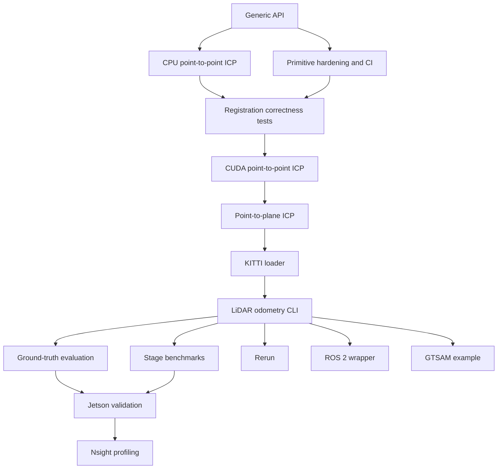

# FlashICP roadmap

FlashICP is a CUDA-accelerated point-cloud registration frontend for autonomous
systems. It started with Barracuda/ZED underwater data and should retain that
support while adding KITTI Velodyne data as the first driving dataset.

This roadmap is intentionally issue-driven. It separates work that is already in
the repository from work that is planned, and keeps odometry, not full SLAM, as
the target application.

## Audited baseline

The current checkout is an early CUDA prototype. The following baseline was run
without a CUDA compiler:

```bash
cmake -B /tmp/flashicp-baseline-build -DUSE_CUDA=OFF -DBUILD_TESTING=ON
cmake --build /tmp/flashicp-baseline-build --parallel
ctest --test-dir /tmp/flashicp-baseline-build --output-on-failure
```

Result: the CPU build passed and all three CTest targets passed.

### Implemented today

- C++17 CPU voxel-grid downsampling in `src/flashicp.hpp`.
- CUDA voxel downsampling in `src/voxel_gpu.cu`:
  - Thrust sort/reduce implementation.
  - Open-addressing atomic-hash implementation with reused scratch buffers.
- CPU brute-force, radius-limited nearest-neighbor correspondence.
- CUDA fixed-radius spatial-hash correspondence in `src/corr_gpu.cu`.
- A custom binary format: `int32 count`, followed by packed `float32 x,y,z`.
- Offline extraction of the documented ROS 2 SQLite bag format through
  `tools/dump_cloud.py`, including NaN/Inf filtering.
- A small `bench`/`corr` CLI and a CPU correspondence self-check.
- A CPU-safe public registration API with SE(3) transforms, explicit options,
  timing, and failure statuses.
- CPU point-to-point ICP using the existing brute-force correspondence baseline
  and a dependency-free Horn rigid solve.
- CTest coverage for primitives, transform algebra, known transforms, noise,
  out-of-radius pairs, invalid input, and degenerate geometry.
- A documented Jetson AGX Orin voxel benchmark, including the initial slower
  sort implementation and the faster atomic-hash result.

### Partial or unverified

- CUDA correspondence is checked in, but the repository does not yet run it in
  CI or have a recorded Jetson execution result.
- The current voxel and correspondence APIs allocate/copy data per call in
  places that will matter in an iterative ICP loop.
- CUDA point-to-point registration is wired behind the public API with a device
  transform kernel and residual reduction, but it has not been compiled or run
  in this environment.
- CUDA is conditionally compiled, but the build hard-codes architecture `87`,
  which is suitable for Orin and not a portable desktop default.
- Correctness checks compare aggregate values or distances; they do not yet
  provide a full registration oracle or per-voxel keyed comparison.
- The PointCloud2 extractor is a useful Barracuda/ZED tool, not a general ROS 2
  bag or runtime ROS integration.

### Not implemented

- Point-to-plane iterative ICP.
- Normal estimation, point-to-plane Jacobians, and 6x6 normal-equation solving.
- KITTI Velodyne loader and calibration/pose handling.
- Sequential LiDAR odometry and trajectory accumulation.
- KITTI metrics, machine-readable evaluation, and registration-failure reports.
- Stage-by-stage CPU/CUDA benchmark suite for registration.
- ROS 2 node, Rerun visualization, or GTSAM example.

The README and the website previously described the target pipeline more
strongly than the source supports. The issue briefs below treat those stages as
planned rather than completed.

## Dependency roadmap



## Milestones and issue order

| Milestone | Issues | Exit condition |
|---|---|---|
| M0 — Audit and scope | [001](issues/001-audit-and-baseline.md), [002](issues/002-generic-core-api.md), [003](issues/003-primitives-and-ci.md) | Existing AUV path is documented, the public boundary is generic, and CPU-only builds remain green. |
| M1 — Correct registration | [004](issues/004-cpu-point-to-point-icp.md), [005](issues/005-registration-tests.md), [006](issues/006-cuda-point-to-point-icp.md) | A known rigid transform is recovered by CPU and CUDA within stated tolerances. |
| M2 — Robotics ICP | [007](issues/007-point-to-plane-icp.md) | Point-to-plane is selectable and reports useful convergence/failure state. |
| M3 — KITTI odometry | [008](issues/008-kitti-loader.md), [009](issues/009-lidar-odometry-cli.md), [010](issues/010-trajectory-evaluation.md) | Consecutive KITTI scans produce an estimated trajectory and reproducible metrics. |
| M4 — Evidence and deployment | [011](issues/011-benchmark-suite.md), [012](issues/012-robustness-experiments.md), [013](issues/013-jetson-validation.md), [014](issues/014-nsight-profiling.md) | CPU/CUDA timing, accuracy, failure boundaries, and Jetson measurements are recorded without invented values. |
| M5 — Optional integrations | [015](issues/015-rerun-visualization.md), [016](issues/016-ros2-wrapper.md), [017](issues/017-gtsam-example.md) | Integrations are modular and do not make the standalone core depend on them. |

Issue [002] is the only intentional API refactor. Existing voxel and
correspondence implementations should be adapted behind it rather than replaced
without a measurement or correctness reason.

## Recommended execution sequence

1. Land the audit/status correction and generic API without changing algorithmic
   behavior.
2. Harden input validation, CUDA configuration, and primitive correctness tests.
3. Implement CPU point-to-point ICP and make it the reference oracle.
4. Add synthetic geometry/noise/failure tests before optimizing CUDA.
5. Implement CUDA point-to-point ICP, initially allowing the small SE(3) solve on
   the host if that makes correctness easier to establish.
6. Add normals and point-to-plane accumulation, first on CPU and then on CUDA.
7. Add KITTI loading, then the sequential odometry command, then evaluation.
8. Add timing and machine-readable output before making performance claims.
9. Run robustness sweeps and Jetson measurements; profile only measured hot spots.
10. Add Rerun, ROS 2, and GTSAM as optional layers after the standalone workflow is
    stable.

## First major definition of done

This milestone is complete when the following command works on a supported CUDA
machine with an available KITTI sequence:

```bash
flashicp odometry \
  --dataset kitti \
  --sequence /data/kitti/sequences/00 \
  --method point-to-plane
```

It must produce:

- an estimated trajectory with an explicitly documented frame convention;
- per-frame registration status, correspondences, iterations, error, and latency;
- ground-truth comparison when the matching KITTI poses are supplied/found;
- aggregate translation/rotation, RPE/ATE where applicable, and failure counts;
- CSV or JSON output suitable for reproducing a report; and
- a CPU fallback plus a CUDA path that is clearly identified in the output.

This is LiDAR odometry. Loop closure, mapping, graph optimization, and a complete
autonomous-driving stack remain out of scope.

## Rules for future issues

- Do not commit KITTI data or generated benchmark clouds.
- Do not claim CUDA speedup without synchronized timing and a stated workload.
- Keep the CPU implementation as the correctness oracle.
- Preserve the Barracuda/ZED extractor and custom binary compatibility unless a
  migration path is provided.
- Record negative results, failed registrations, and slow kernels alongside
  successful runs.
- Keep ROS 2, Rerun, and GTSAM optional at the build and dependency boundary.
